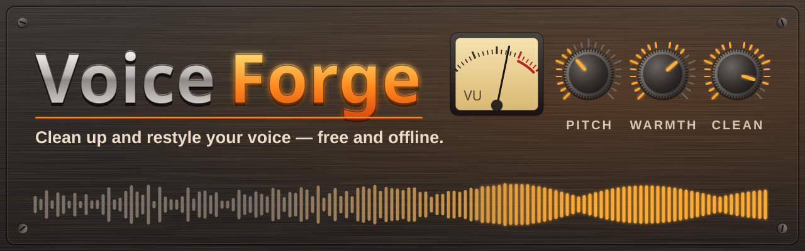
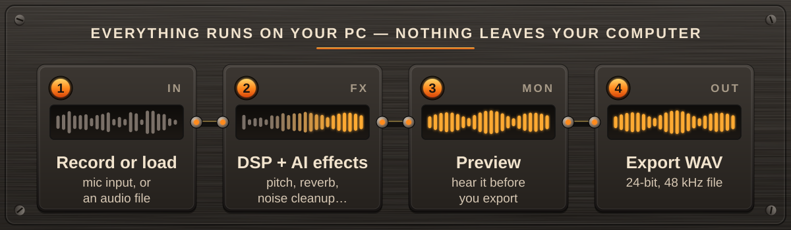
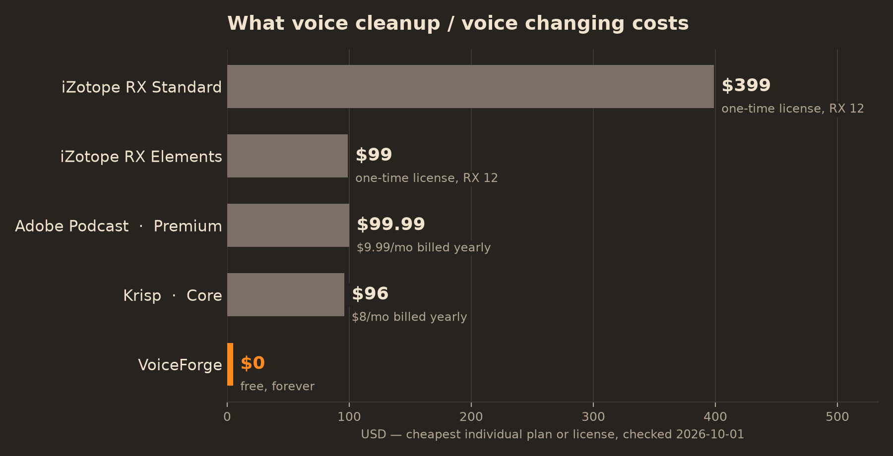

<p align="center">
  
</p>

<p align="center">
  <a href="https://github.com/awesomo913/VoiceForge/releases/latest"></a>
  <a href="https://github.com/awesomo913/VoiceForge/releases"></a>
  <a href="LICENSE"></a>
  
  <a href="https://github.com/awesomo913/VoiceForge/actions/workflows/ci.yml"></a>
  
</p>

<p align="center"><b>Record or load a voice clip, run it through DSP and AI effects, and export a clean WAV — no cloud upload, no account, no subscription.</b></p>

<p align="center">
  <a href="https://github.com/awesomo913/VoiceForge/releases/latest"><b>⬇ Download for Windows</b></a>
</p>

<p align="center">
  
</p>

## Why VoiceForge

- **Actually local.** Every effect — DSP, AI noise cleanup, optional voice conversion — runs on your own CPU. Your voice never leaves your machine.
- **Free and open source.** No paywall, no upsell, no telemetry, no account. (See [Third-party components](THIRD_PARTY.md) for the licenses of what's bundled — not everything underneath is MIT.)
- **Real voice-shaping, not a toy.** Pitch/formant shift, vibrato, noise gate, de-esser, clarity, warmth, reverb, and echo, built on [pedalboard](https://github.com/spotify/pedalboard) and [pyrubberband](https://github.com/bmcfee/pyrubberband).
- **AI noise cleanup, built in.** Noise suppression and voice restoration via [DeepFilterNet](https://github.com/Rikorose/DeepFilterNet), with its model weights bundled in the release exe — works out of the box, no first-run download. Degrades gracefully to a pass-through if it ever can't load, instead of crashing.
- **11 built-in presets** across four categories (My Voices, Reel Personas, Assistants, Characters), plus save/load/import/export for your own.
- **Your voice, your choice.** Optional voice conversion (RVC) only runs on a model file *you* provide — see [Voice conversion ethics](#voice-conversion-ethics) below.

## Quick start

1. **[Download the latest release](https://github.com/awesomo913/VoiceForge/releases/latest)** and run `VoiceForge.exe` (Windows), or [build from source](#build-from-source).
2. Click **● REC** to record from your microphone, or load an existing clip.
3. Pick a preset or drag the sliders yourself, click **▶ PREVIEW** to hear it, then **⬇ EXPORT WAV** to save a 24-bit WAV file.

## How it works

<p align="center">
  
</p>

1. You record from your microphone or load an audio file.
2. The DSP layer (pitch, formants, reverb, echo, de-esser, …) and, optionally, the AI noise-cleanup layer process the audio.
3. Click Preview to hear the result before committing to anything.
4. Export writes a 24-bit, 48 kHz WAV file with loudness normalization applied.

## Features

| Feature | Detail |
|---------|--------|
| **Fully offline** | Runs on your machine — nothing leaves your device, no network calls at all |
| **DSP effects** | Pitch, formant shift, vibrato, noise gate, de-esser, clarity (compression + EQ), warmth, reverb, echo |
| **AI noise cleanup** | Noise suppression + voice restoration via DeepFilterNet, model weights bundled (no download needed); logs and passes audio through unchanged in the rare case it can't load |
| **Optional voice conversion (RVC)** | Off by default; only runs against a `.pth`/`.index` model **you** supply — see [Voice conversion ethics](#voice-conversion-ethics) |
| **11 built-in presets** | My Voices, Reel Personas, Assistants, Characters — plus save/load/delete/rename/import/export for your own |
| **Session auto-save** | Your last settings are restored on next launch (`~/.voiceforge/last_session.json`) |
| **Export** | 24-bit, 48 kHz WAV via an FFmpeg filter chain with loudness normalization |
| **Windows .exe** | Single-file executable via `build.py` |

## Usage

```bash
# Launch the GUI
python main.py
```

VoiceForge is a desktop GUI app — there is currently no CLI/batch mode. See [Limitations](#limitations) for what that means in practice.

## Voice conversion ethics

The optional RVC (Retrieval-based Voice Conversion) layer lets you re-voice a recording using a trained voice model — but:

- **No voice models are bundled with VoiceForge.** The `models/` folder ships empty (only a `.gitkeep` placeholder).
- **You must supply your own model** (a `.pth` file, plus an optional `.index` file) via the "AI Voice (RVC)" tab's **Browse** buttons. VoiceForge does not download, link to, or recommend any specific model.
- **Only use voices you own or have explicit permission to use.** Do not use this feature to impersonate a real person without their consent, for fraud, harassment, or to create misleading media. VoiceForge has no way to verify where a model file came from or who consented to it — that responsibility is yours.
- On Windows, RVC conversion is currently **unavailable regardless of settings** — see [Limitations](#limitations) — so this layer always passes audio through unchanged today. The setting and model-loading UI exist for forward compatibility and for contributors building on non-Windows platforms where `rvc_python`'s dependencies are installable.

## Comparison

<p align="center">
  
</p>

Prices below are the **cheapest individual/consumer plan or license** that includes comparable voice cleanup or voice-changing features, looked up directly on the vendor's official pricing page where it would load. Checked **2026-10-01**.

| Product | Plan | Price | Billing | Source |
|---|---|---|---|---|
| **VoiceForge** | — | $0³ | — | (this project) |
| iZotope RX Elements | RX 12 Elements | $99.00 | one-time, perpetual license | [izotope.com/en/shop/rx-elements.html](https://www.izotope.com/en/shop/rx-elements.html) |
| iZotope RX Standard | RX 12 Standard | $399.00 | one-time, perpetual license | [izotope.com/en/shop/rx-standard](https://www.izotope.com/en/shop/rx-standard) |
| Adobe Podcast | Premium | $9.99/mo¹ | $99.99/yr billed yearly | [podcast.adobe.com](https://podcast.adobe.com/en/enhance)¹ |
| Krisp | Core | $16/mo | $8/mo billed yearly (~$96/yr) | [krisp.ai/pricing](https://krisp.ai/pricing) |
| Voicemod | Pro | *could not confirm*² | — | [voicemod.net](https://voicemod.net/) |

¹ Adobe's official pricing page is a JavaScript application that didn't return readable pricing text to an automated fetch; the $9.99/mo ($99.99/yr) figure is cross-checked across third-party pricing trackers, not read directly from the rendered page the way the iZotope and Krisp prices were — verify on [podcast.adobe.com](https://podcast.adobe.com/en/enhance) before quoting this elsewhere.

² Voicemod's `/pricing` page no longer displays any prices (it redirects to the homepage, which only shows "Download for Free"), and third-party trackers disagree with each other (figures seen range from ~$2.49/mo to ~$15/mo depending on billing term and source). Rather than guess, this is left unconfirmed — check inside the Voicemod app for current pricing.

³ Unlike the paid tools above, VoiceForge's AI noise cleanup needs no subscription or login — but it does mean a larger download (the exe bundles a CPU build of PyTorch). See [Limitations](#limitations) for the exact size and why.

A few structural differences worth being upfront about:

| | VoiceForge | Voicemod | iZotope RX / Adobe Podcast / Krisp |
|---|---|---|---|
| Cost | Free | Freemium + paid tiers | Paid (subscription or license) |
| Works offline | Yes, always | Partial (free tier) | Varies |
| Audio leaves your PC | No, never | Varies | Usually no (local processing), but account/telemetry involved |
| **Real-time voice changing (while you talk)** | **No** — process, then preview/export | **Yes** — its core feature | No (these are post-production tools, like VoiceForge) |
| Open source | Yes | No | No |

## Limitations

Being upfront about what this is and isn't:

- **Not real-time.** VoiceForge processes a recorded or loaded clip, not a live microphone stream — if you want a live voice changer for calls/games, that's a different category of tool (e.g. Voicemod).
- **Voice conversion (RVC) doesn't run on Windows today.** `rvc_python`'s dependency (`fairseq`) has no installable Windows wheel, so on Windows the RVC layer always passes audio through unchanged, even if you load a model and enable it. This is a known upstream packaging gap, not a bug in VoiceForge's own code — the code path is written and tested, it just has nothing to run against on this platform.
- **Formant shift needs the external `rubberband` command-line tool, which isn't bundled.** It's GPL-2.0-licensed, and this project doesn't automatically download and embed third-party executables as part of a build (see [THIRD_PARTY.md](THIRD_PARTY.md)) — vendoring it is a manual, human-verified step. Without it, formant shift falls back to pedalboard's pitch-only shifter (pitch shifting itself still works fine); the app surfaces this once in the status bar ("Formant shift unavailable — install rubberband") rather than failing silently.
- **The release `.exe` is large (~165 MB) because AI noise cleanup is fully bundled.** That includes a CPU-only build of PyTorch (DeepFilterNet's inference backend) and the ~8 MB model itself, so noise cleanup works offline with no first-run download — the tradeoff is a bigger download than a pure-DSP tool would need.
- **No CLI or batch mode.** VoiceForge is GUI-only; there's no scripted way to process a folder of files.
- **No built-in voice models.** You must supply your own RVC model if you want voice conversion — see [Voice conversion ethics](#voice-conversion-ethics).
- **GUI needs a desktop environment.** The GUI (CustomTkinter/Tkinter) doesn't run headless.
- **Windows only.** `sounddevice`/`pyrubberband`/the packaged `.exe` are tested on Windows; other platforms are untested.
- **The release `.exe` is unsigned.** See the FAQ below.
- **Licensing is mixed, not purely MIT.** This project's own code is MIT, but it uses `pedalboard` (GPL-3.0) directly as a library — see [THIRD_PARTY.md](THIRD_PARTY.md) for the open question this raises and what it means for redistribution.

## FAQ

<details>
<summary>Windows says "Windows protected your PC" — is this safe?</summary>

VoiceForge's release `.exe` isn't code-signed (signing certificates cost money for an independent open-source project), so Windows SmartScreen flags unknown publishers by default. Click **More info → Run anyway**, or verify the download against `SHA256SUMS.txt` on the [release page](https://github.com/awesomo913/VoiceForge/releases/latest), or build from source yourself (see below).
</details>

<details>
<summary>My antivirus flagged the .exe — is it malware?</summary>

PyInstaller-built executables are frequently false-positived by antivirus engines because the same packing technique is also used by actual malware to bundle a Python interpreter. This is a known, common issue for PyInstaller apps in general. If you'd rather not trust the prebuilt binary, build from source — it's a few commands (below) and you can read every line first.
</details>

<details>
<summary>Does this send my recordings or voice to the internet?</summary>

No. VoiceForge makes no network calls during normal use — recording, processing, previewing, and exporting all happen locally on your machine. There is no account, no cloud model, no telemetry.
</details>

<details>
<summary>Can I use someone else's voice (a celebrity, a public figure) with the RVC feature?</summary>

Please don't. VoiceForge ships with no voice models and will never bundle or recommend one. If you use the optional voice-conversion feature with a model you obtained elsewhere, only use voices you own or have explicit permission to use — see [Voice conversion ethics](#voice-conversion-ethics).
</details>

<details>
<summary>Why doesn't voice conversion (RVC) do anything?</summary>

On Windows, `rvc_python`'s own dependency (`fairseq`) has no installable wheel, so there's currently no backend for this feature to run against on Windows — see [Limitations](#limitations). The UI and the model-loading code are in place for when that upstream gap closes, or for contributors on platforms where it's installable.
</details>

<details>
<summary>I moved the pitch or formant slider but only the pitch changed — why?</summary>

Formant shift needs the external `rubberband` command-line tool, which isn't bundled in the default build (see [Limitations](#limitations) and [THIRD_PARTY.md](THIRD_PARTY.md) for why). Without it, VoiceForge automatically falls back to pitch-only shifting and shows "Formant shift unavailable — install rubberband" in the status bar once per session. Pitch shifting itself is unaffected either way.
</details>

<details>
<summary>Something failed — where's the log?</summary>

VoiceForge writes a plain-text log to `%LOCALAPPDATA%\VoiceForge\logs\app.log` on Windows (`~/.local/state/VoiceForge/logs/app.log` elsewhere) via `diagnostics_logger.py`. If you open an issue, attaching the last few lines helps a lot — they contain state transitions and timings, never your audio content.
</details>

## Build from source

Requires Python 3.11.

```bash
git clone https://github.com/awesomo913/VoiceForge.git
cd VoiceForge
uv venv --python 3.11
uv pip install -r requirements.txt
python main.py
```

Build the standalone Windows exe:

```bash
uv pip install -r requirements-dev.txt
python build.py
# → dist/VoiceForge.exe
```

This bundles AI noise cleanup (torch + the DeepFilterNet model) automatically — no extra steps needed. Formant shift is the one feature that needs a manual step to work in the built exe: see [vendor/README.md](vendor/README.md) if you want to vendor the `rubberband` CLI yourself. Skipping it is fine; the build just falls back to pitch-only shifting.

Run tests and lint:

```bash
pytest
ruff check .
```

## Contributing

Contributions are welcome — see [CONTRIBUTING.md](CONTRIBUTING.md) for dev setup, architecture notes, code style, and the preset-naming rule. Please also see our [Code of Conduct](CODE_OF_CONDUCT.md).

If VoiceForge is useful to you, a ⭐ helps others find it.

## License

[MIT](LICENSE) © 2026 awesomo913

## Publisher

Published by **Revolutionary Designs**.
GitHub: https://github.com/awesomo913
Contact: contact@revolutionarydesigns.io  <!-- pii-ok: official brand contact -->
